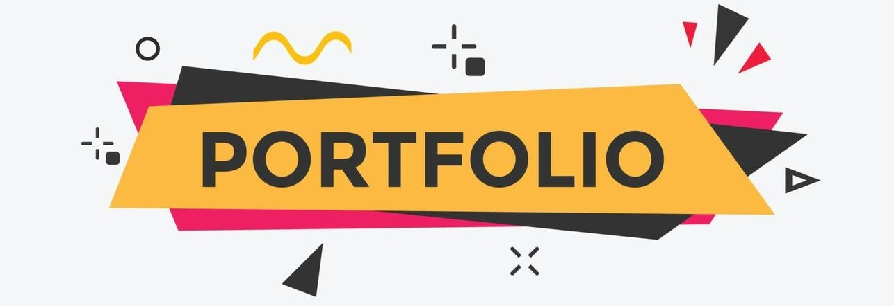
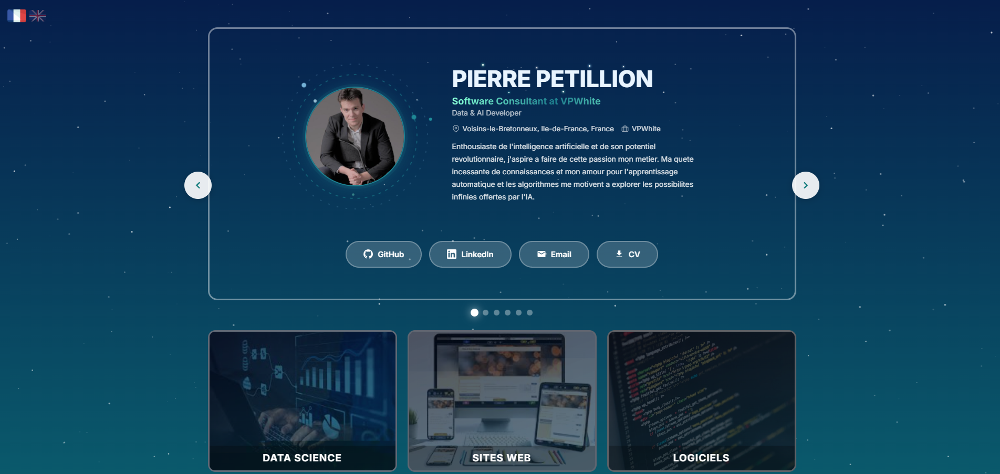

<h1 align="center">
  
</h1>

---

## Aperçu
Portfolio interactif et créatif présentant mon parcours, mes compétences, mes projets, et mes recommandations dans les domaines du graphisme, de la création et du design.

## Technologie

* HTML5 / CSS3 / JavaScript Vanilla
* Canvas API (animations étoiles)
* SVG animé (orbites constellation)
* Google Analytics GA4

## Objectifs
- Mettre en valeur mon parcours scolaire et professionnel.
- Présenter mes réalisations graphiques et créatives.
- Proposer une navigation moderne, claire et esthétique.
- Faciliter le contact et l’accès à mon CV/LinkedIn.

## Aperçu de l’interface

## Auteur

- [Pierre-Portfolio](https://github.com/Pierre-Portfolio/)

---

Projet démarré en 2026 et mis à jour régulièrement.
